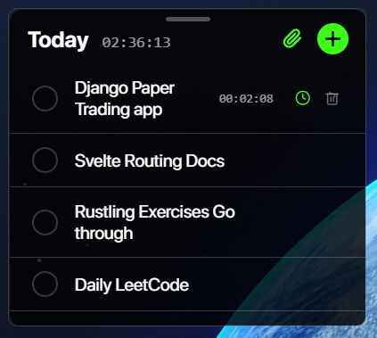
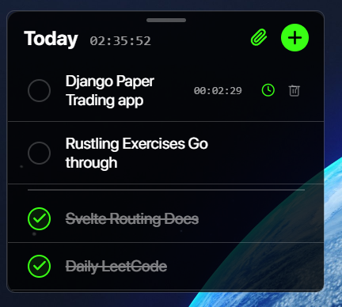

# Krona-Lite

A minimalist, background-oriented to-do application for focus.

<h3>

[Download Latest Release](https://github.com/zendrixate/krona-lite/releases)

</h3>

---

Krona-Lite is a tiny utility that runs in the background, designed to keep your tasks front-and-center without the clutter of a traditional application. It's built for speed, focus, and simplicity.

_Clean interface that stays out of your way._

_Completed tasks are neatly separated._

## Features

- **Minimalist UI:** A clean, borderless window that runs in the background.
- **Persistent Data:** Tasks are automatically saved to a `todos.json` file in your `Documents/Krona` folder.
- **Always on Top:** Pin the window to keep it visible over all other applications.
- **Task Timers:** Track the time spent on each individual task.
- **Dynamic Sizing:** The window automatically adjusts its height to fit your tasks.
- **Drag to Move:** Use the subtle handle at the top of the window to move it with your mouse.
- **Drag to Reorder:** Reorganize your active and completed tasks by dragging them.

### Dynamic Interaction Demo
This demonstrates the drag-to-reorder, dynamic window sizing, and task focus features.
<video src="readme_media/video1.mp4" autoplay loop muted playsinline title="Drag and drop, focus, and resizing demo"></video>

## Installation

The latest release is available on the [GitHub Releases](https://github.com/zendrixate/krona-lite/releases) page.

1.  Download `Krona-Lite_0.1.0_x64-setup.exe`.
2.  Run the installer. The app will start automatically in the background.

## Usage

-   **Show/Hide Window:** Press the `END` key.
-   **Move Window:** Click and drag the handle at the top of the window.
-   **Pin Window:** Click the pin icon in the header.
-   **Add Task:** Click the `+` icon.
-   **Edit Task:** Double-click the task text.
-   **Complete Task:** Click the checkbox.
-   **Track Time:** Hover over a task and click the watch icon.
-   **Delete Task:** Hover over a task and click the trash icon.
